# 06 图表与结果表达

> **版本说明：** M奖以上优秀论文整页截图案例版 v5

> Markdown 版由原 Word 手册整理，21 张案例图均按正文顺序提取。原件见[原始文档](原始文档/图表与结果表达案例手册.docx)。

这一版按你最新要求改回“整页论文截图”。上一版裁图虽然更紧凑，但确实容易把上下文裁没，看起来像碎片。这版保留优秀论文原页，让你能看到图表在论文里的真实位置：图前怎么铺垫，图后怎么解释，公式、表格、文字和图是怎么接上的。

排版上我不再乱截图片，而是用整页截图做案例证据；每张图前后用更细的讲解填充，尽量减少空白。也保留一点口语化提醒，方便你真正拿它改论文，而不是只看漂亮排版。

| 版本改动 | 说明 |
| --- | --- |
| 图片 | 全部使用整页优秀论文截图，不再裁图。 |
| 内容 | 保留 v4 的细致讲解，并补充“整页案例怎么看”。 |
| 版式 | 单栏密集讲义式，不做大封面空白页。 |
| 用途 | 适合直接对照优秀论文，学习图表在正文中的位置和写法。 |

## 01 总框架图：先看整页里它放在哪里

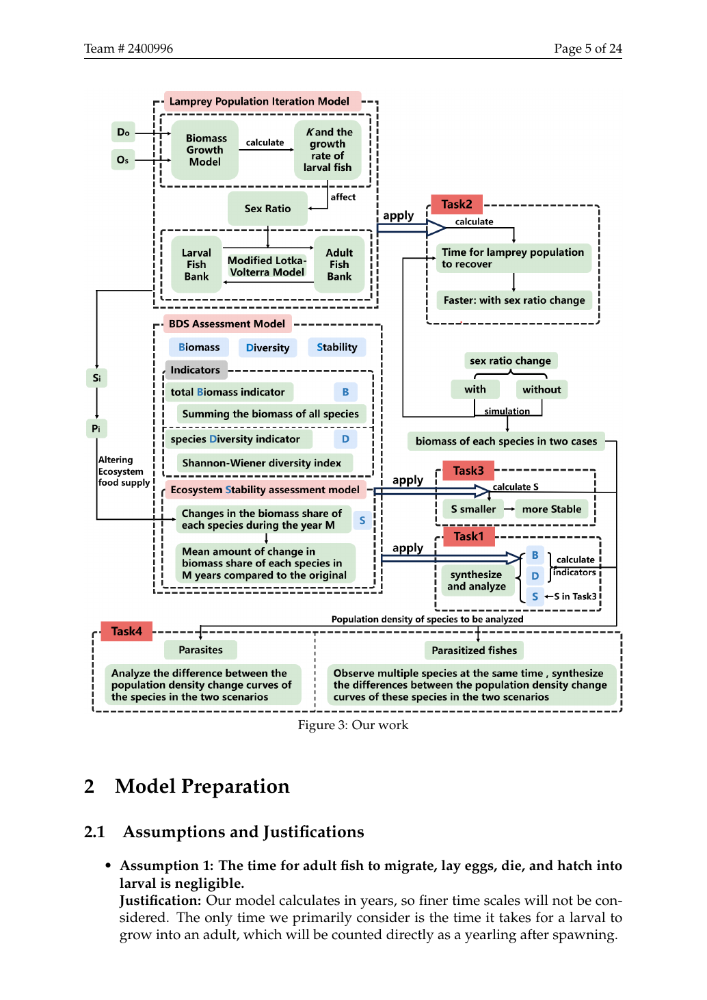

*2024 A 题整页案例：模型总览图放在模型准备之前。*

这页最值得学的不是图形本身，而是位置。优秀论文在进入假设和公式前，先用一张总框架图告诉评委：本文有哪几个任务、哪几个模型、指标如何流动。整页截图能看到它下面马上接“Model Preparation”，说明框架图是正文的入口，不是后面随便补的装饰。

写自己的论文时，框架图不要放到附录，也不要放到结论后面。它应该尽早出现，帮评委建立阅读地图。

> **这一页怎么学：** 先看图放在论文哪个位置，再看图前有没有铺垫，图后有没有解释。真正要模仿的是这个“位置和连接”，不是直接复制图。

> **写作提醒：** 图表不是撑版面的东西。每张图都要能接一句“因此”，否则它还没有变成论文证据。

## 02 工作流程图：整页看图前铺垫和图后承接

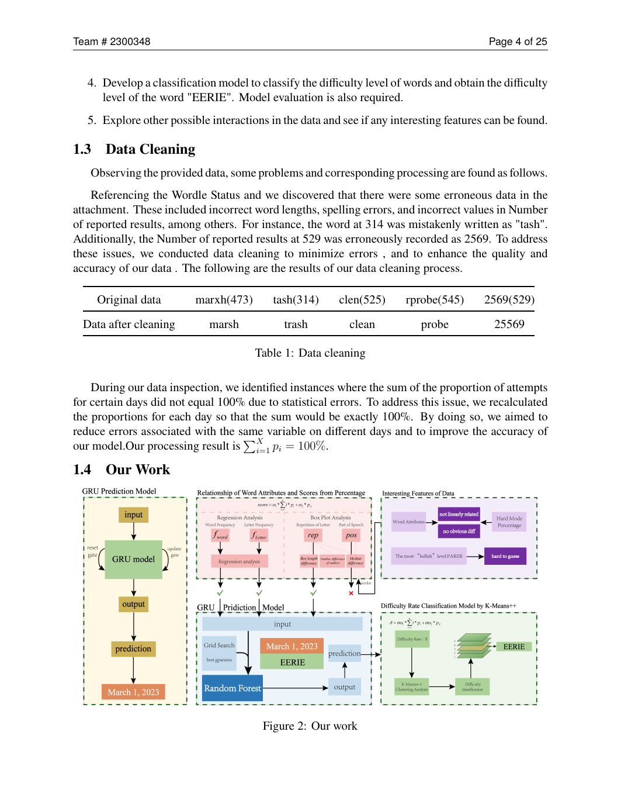

*2023 C 题整页案例：流程图出现在 Our Work 附近。*

这一页能看出优秀论文的节奏：先讲问题和数据，再放流程图，然后后文按流程图展开。流程图不是孤立图片，而是文章结构的索引。

你写的时候也可以照这个结构：问题重述后写“本文工作如下”，放流程图，再用一小段解释每个模块。

> **这一页怎么学：** 先看图放在论文哪个位置，再看图前有没有铺垫，图后有没有解释。真正要模仿的是这个“位置和连接”，不是直接复制图。

> **写作提醒：** 图表不是撑版面的东西。每张图都要能接一句“因此”，否则它还没有变成论文证据。

## 03 机制流程图：图和建模假设连在一起

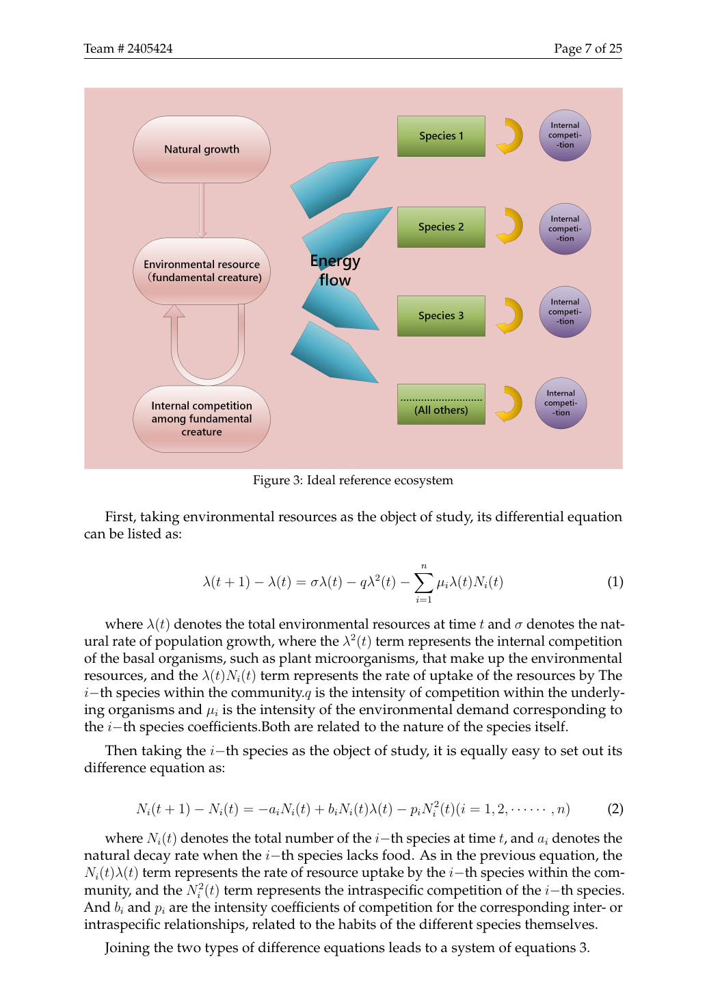

*2024 A 题整页案例：机制图服务生态关系解释。*

整页保留下来后能看到，机制图不是单独漂在页面中央，它周围有研究背景和模型设定文字。这个上下文很重要：机制图负责把生物关系转成建模关系。

自己的论文如果有机制图，一定要在图前说明为什么需要这张图，图后说明它如何进入变量和方程。

> **这一页怎么学：** 先看图放在论文哪个位置，再看图前有没有铺垫，图后有没有解释。真正要模仿的是这个“位置和连接”，不是直接复制图。

> **写作提醒：** 图表不是撑版面的东西。每张图都要能接一句“因此”，否则它还没有变成论文证据。

## 04 地图：整页看数据来源和空间图如何相接

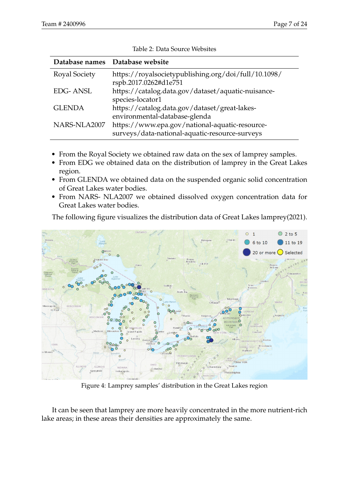

*2024 A 题整页案例：数据来源表后接空间分布地图。*

这页非常适合学数据章节写法。上面是数据来源表，下面是地图，中间文字说明数据怎么来、地图展示什么。这样评委会觉得图不是凭空来的，而是数据链条的一部分。

地图后面要写空间结论。比如集中在哪里，是否和环境因素有关，后续模型是否要考虑空间差异。

> **这一页怎么学：** 先看图放在论文哪个位置，再看图前有没有铺垫，图后有没有解释。真正要模仿的是这个“位置和连接”，不是直接复制图。

> **写作提醒：** 图表不是撑版面的东西。每张图都要能接一句“因此”，否则它还没有变成论文证据。

## 05 折线图：整页看图后分析怎么写

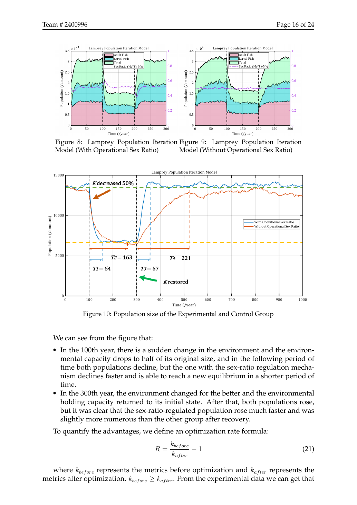

*2024 A 题整页案例：折线图后直接跟解释条目和公式。*

这页最值得学的是图后分析。图下面不是一句“如图所示”，而是马上解释第100年、第300年的变化，再引出优化率公式。整页截图能看到“图—解释—公式”的完整链条。

你自己的折线图也要这样写：先讲关键时间点，再讲实验组和对照组差别，最后把差别转成评价指标。

> **这一页怎么学：** 先看图放在论文哪个位置，再看图前有没有铺垫，图后有没有解释。真正要模仿的是这个“位置和连接”，不是直接复制图。

> **写作提醒：** 图表不是撑版面的东西。每张图都要能接一句“因此”，否则它还没有变成论文证据。

## 06 多折线对比：整页看模型对比怎么嵌入正文

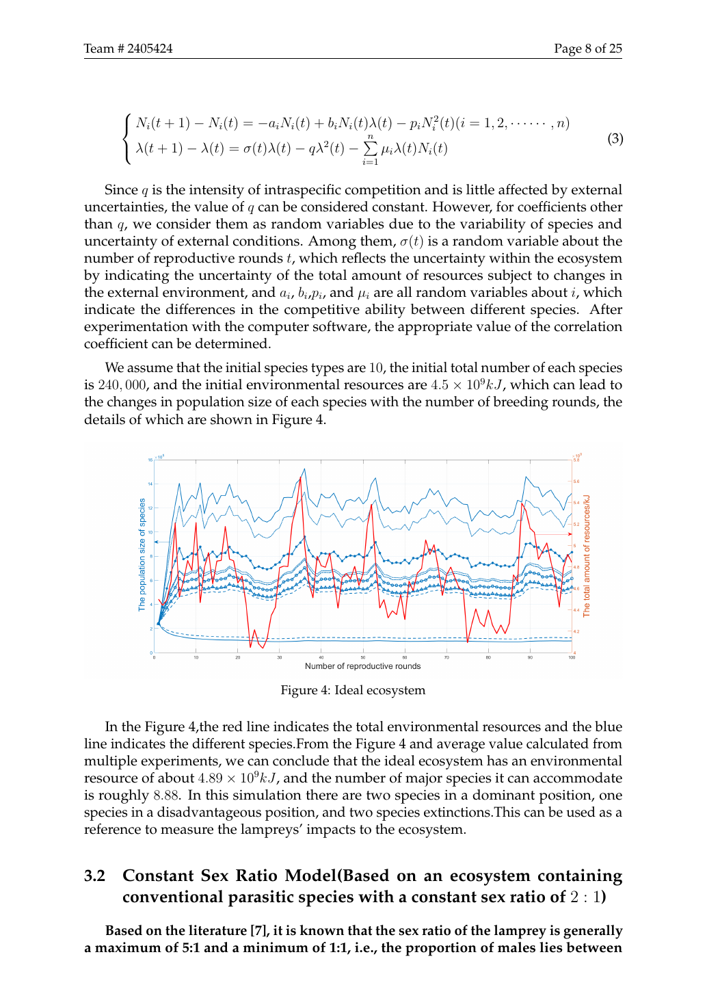

*2024 A 题整页案例：多折线图嵌在模型建立小节中。*

多折线图如果只截图本体，会看不出它服务哪个模型。整页保留后，可以看到它前后是模型方程和解释文字，说明曲线是模型运行结果，不是单独的数据展示。

自己的论文要避免把多折线图突然扔出来。图前交代模型和参数，图后解释差异来源。

> **这一页怎么学：** 先看图放在论文哪个位置，再看图前有没有铺垫，图后有没有解释。真正要模仿的是这个“位置和连接”，不是直接复制图。

> **写作提醒：** 图表不是撑版面的东西。每张图都要能接一句“因此”，否则它还没有变成论文证据。

## 07 参数扰动图：整页看敏感性分析的位置

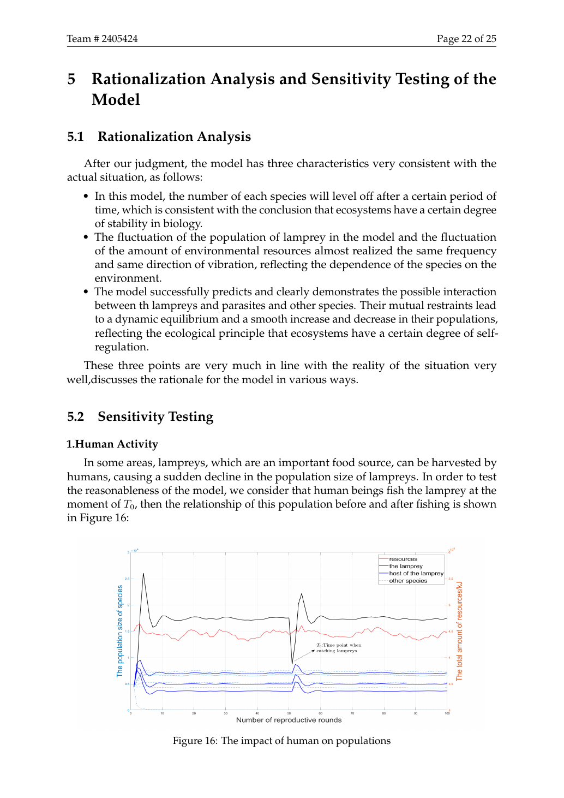

*2024 A 题整页案例：敏感性分析放在模型评价部分。*

敏感性分析通常不放在模型建立前，而是放在模型评价或讨论中。整页截图能看到它作为“模型是否稳健”的证据，而不是核心求解结果。

写的时候要说扰动范围、结论是否保持、哪个参数最敏感。

> **这一页怎么学：** 先看图放在论文哪个位置，再看图前有没有铺垫，图后有没有解释。真正要模仿的是这个“位置和连接”，不是直接复制图。

> **写作提醒：** 图表不是撑版面的东西。每张图都要能接一句“因此”，否则它还没有变成论文证据。

## 08 热力矩阵：整页看颜色图和文字解释

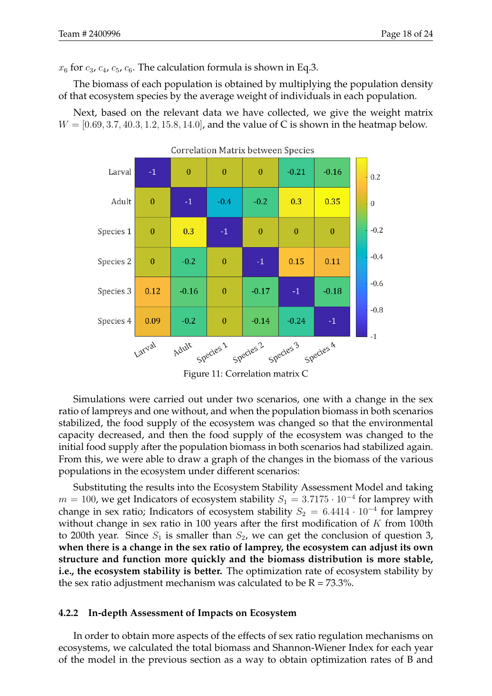

*2024 A 题整页案例：矩阵图和解释段落同页出现。*

热力图最怕只剩颜色。整页保留后，可以看到它周围有解释文字，说明颜色背后的含义和结论。

自己的热力图要写色标、阈值、高值区、低值区，不要让评委自己猜颜色。

> **这一页怎么学：** 先看图放在论文哪个位置，再看图前有没有铺垫，图后有没有解释。真正要模仿的是这个“位置和连接”，不是直接复制图。

> **写作提醒：** 图表不是撑版面的东西。每张图都要能接一句“因此”，否则它还没有变成论文证据。

## 09 散点回归：整页看统计量如何跟图配合

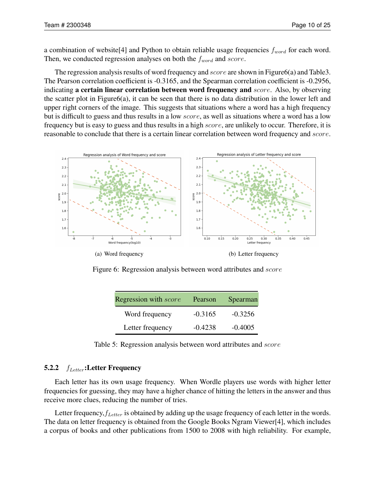

*2023 C 题整页案例：散点图、相关系数表和解释文字同页。*

这页是非常好的散点图写法：图上有拟合趋势，图下有相关系数表，正文还有 Pearson 和 Spearman 的解释。整页比裁图更有价值，因为它展示了“图+表+文字”的完整组合。

你的散点图也应该配统计量。只靠肉眼判断相关性，论文会显得虚。

> **这一页怎么学：** 先看图放在论文哪个位置，再看图前有没有铺垫，图后有没有解释。真正要模仿的是这个“位置和连接”，不是直接复制图。

> **写作提醒：** 图表不是撑版面的东西。每张图都要能接一句“因此”，否则它还没有变成论文证据。

## 10 箱线图：整页看分布分析怎么落到结论

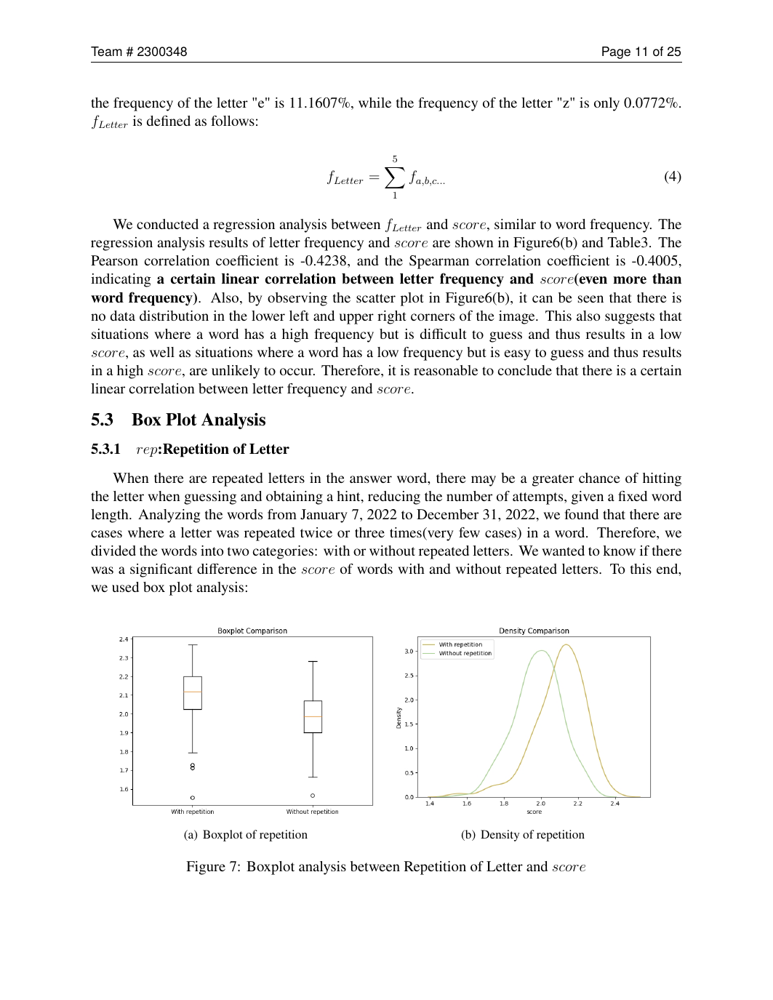

*2023 C 题整页案例：箱线图、密度图和正文解释。*

箱线图和密度图放在同一页，能同时说明中位数、离散程度和分布形状。整页截图保留了上下文，能看到作者如何从“重复字母”解释到得分差异。

你写箱线图时，不要只说高低，还要说稳不稳、重叠多不多。

> **这一页怎么学：** 先看图放在论文哪个位置，再看图前有没有铺垫，图后有没有解释。真正要模仿的是这个“位置和连接”，不是直接复制图。

> **写作提醒：** 图表不是撑版面的东西。每张图都要能接一句“因此”，否则它还没有变成论文证据。

## 11 第二组箱线图：整页看同类图如何保持风格

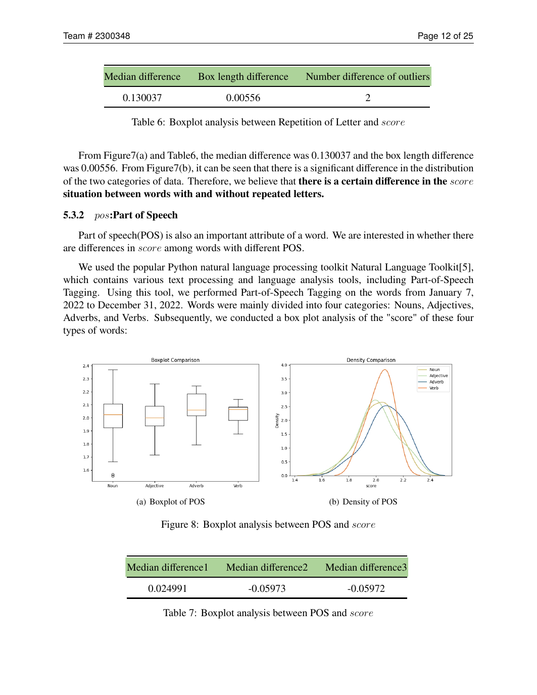

*2023 C 题整页案例：同类分布图继续沿用相似格式。*

这页适合学全篇统一。优秀论文里相似分析会沿用相似图表形式，这样读者不用重新学习图形含义。

你自己的论文也要保持同类图统一：颜色、坐标、图例、标题格式尽量一致。

> **这一页怎么学：** 先看图放在论文哪个位置，再看图前有没有铺垫，图后有没有解释。真正要模仿的是这个“位置和连接”，不是直接复制图。

> **写作提醒：** 图表不是撑版面的东西。每张图都要能接一句“因此”，否则它还没有变成论文证据。

## 12 柱状图和地图组合：整页看政策类图表表达

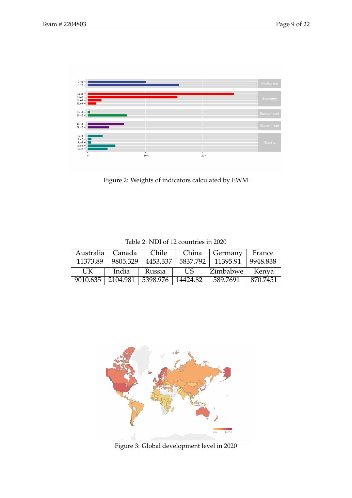

*2022 F 题整页案例：权重柱状图、表格和全球分布图组合。*

这页内容很满，也很适合政策评价类题。它把权重、表格、地图放在同一页，说明指标不仅有数值，还有全球空间解释。

这种组合适合国别评价、区域风险、资源分配题，但正文必须讲清每张图负责什么证据。

> **这一页怎么学：** 先看图放在论文哪个位置，再看图前有没有铺垫，图后有没有解释。真正要模仿的是这个“位置和连接”，不是直接复制图。

> **写作提醒：** 图表不是撑版面的东西。每张图都要能接一句“因此”，否则它还没有变成论文证据。

## 13 雷达图：整页看敏感性/综合画像怎么写

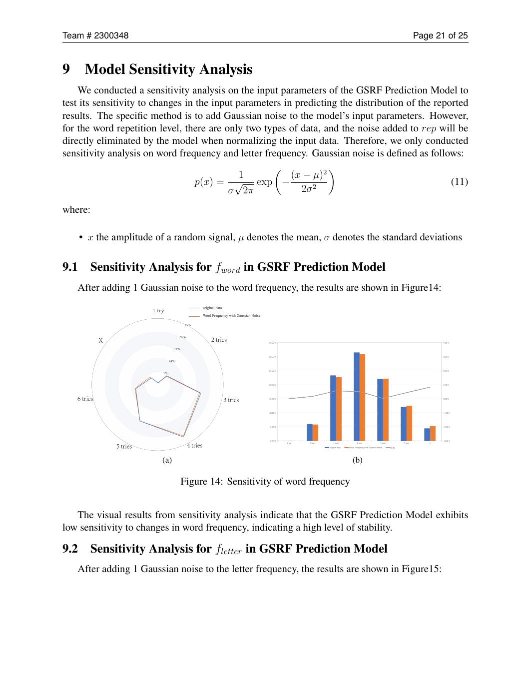

*2023 C 题整页案例：雷达图与柱状图配合。*

整页截图能看到雷达图不是单独决策，而是和柱状图、敏感性分析文字一起出现。雷达图看结构，柱状图看数量。

自己的雷达图一定要说明评分口径，否则面积看起来再大也没有意义。

> **这一页怎么学：** 先看图放在论文哪个位置，再看图前有没有铺垫，图后有没有解释。真正要模仿的是这个“位置和连接”，不是直接复制图。

> **写作提醒：** 图表不是撑版面的东西。每张图都要能接一句“因此”，否则它还没有变成论文证据。

## 14 雷达+柱状第二例：整页看图后评价

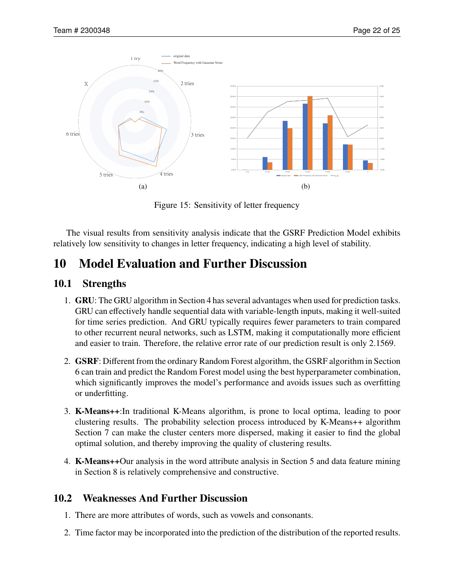

*2023 C 题整页案例：模型评价小节中的图表组合。*

这页展示的是模型评价部分的表达。图表之后有优缺点分析，这很关键：图不是结尾，图后评价才是结论。

写模型评价时，别只说模型好，要说好在哪里、差在哪里、后续怎么改。

> **这一页怎么学：** 先看图放在论文哪个位置，再看图前有没有铺垫，图后有没有解释。真正要模仿的是这个“位置和连接”，不是直接复制图。

> **写作提醒：** 图表不是撑版面的东西。每张图都要能接一句“因此”，否则它还没有变成论文证据。

## 15 环图：整页看比例图如何配结果解释

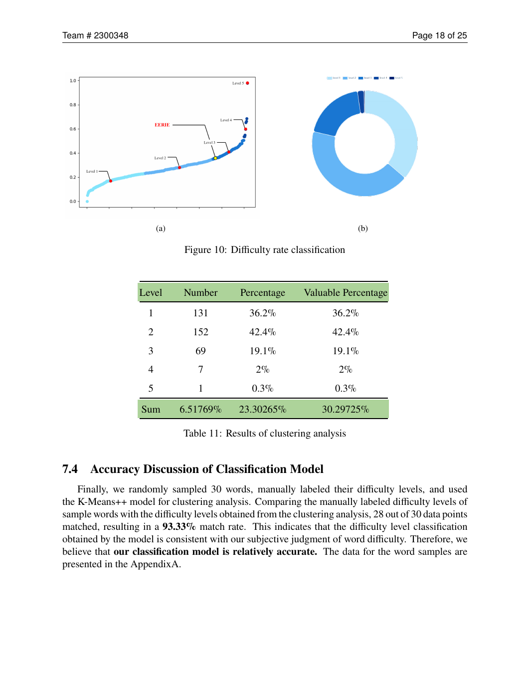

*2023 C 题整页案例：环图和难度/分类解释同页。*

饼图或环图适合构成比例，但单独放会显得薄。整页可以看到它和折线/表格/文字一起服务结果解释。

自己的环图要控制类别数量，重点写最大占比和关键小类。

> **这一页怎么学：** 先看图放在论文哪个位置，再看图前有没有铺垫，图后有没有解释。真正要模仿的是这个“位置和连接”，不是直接复制图。

> **写作提醒：** 图表不是撑版面的东西。每张图都要能接一句“因此”，否则它还没有变成论文证据。

## 16 逻辑树：整页看指标体系如何展开

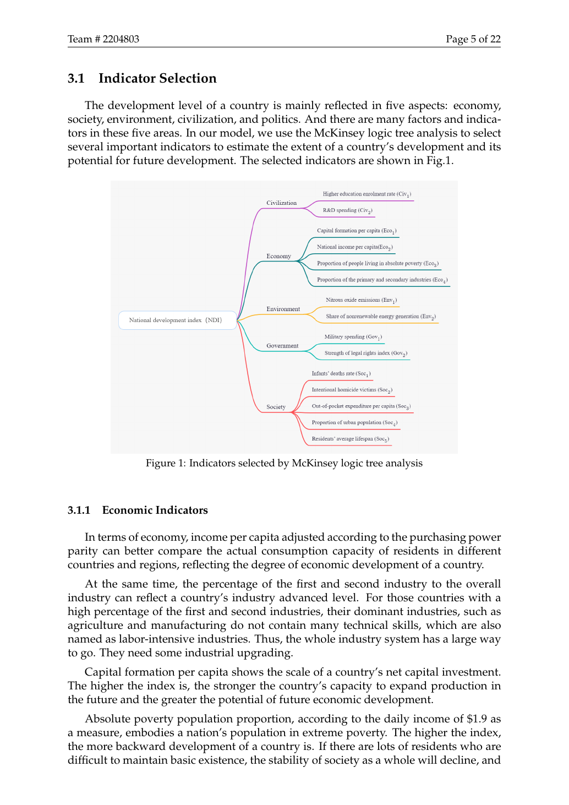

*2022 F 题整页案例：逻辑树下接指标解释。*

逻辑树裁出来能看结构，但整页能看到它下方立刻进入指标选择解释。这才是完整写法：图只是目录，正文负责解释每个指标。

评价类题目一定要说明指标来源、方向、数据可得性和最终用途。

> **这一页怎么学：** 先看图放在论文哪个位置，再看图前有没有铺垫，图后有没有解释。真正要模仿的是这个“位置和连接”，不是直接复制图。

> **写作提醒：** 图表不是撑版面的东西。每张图都要能接一句“因此”，否则它还没有变成论文证据。

## 17 聚类结果：整页看分类后怎么解释

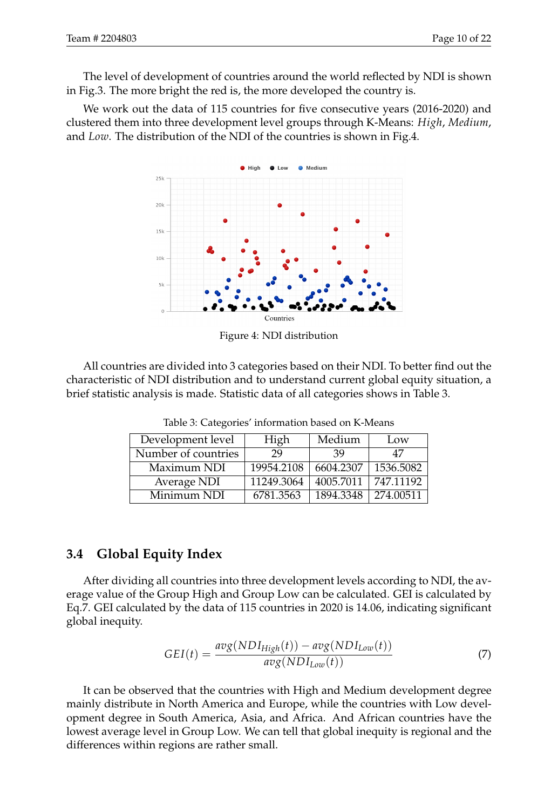

*2022 F 题整页案例：聚类图和分类说明。*

聚类图最重要的是分类含义。整页截图能看到作者在图后继续说明类别，而不是只展示彩色点。

自己的聚类图要给每类命名，并说明为什么这样分类有现实意义。

> **这一页怎么学：** 先看图放在论文哪个位置，再看图前有没有铺垫，图后有没有解释。真正要模仿的是这个“位置和连接”，不是直接复制图。

> **写作提醒：** 图表不是撑版面的东西。每张图都要能接一句“因此”，否则它还没有变成论文证据。

## 18 验证页：整页看验证不是一句“较好”

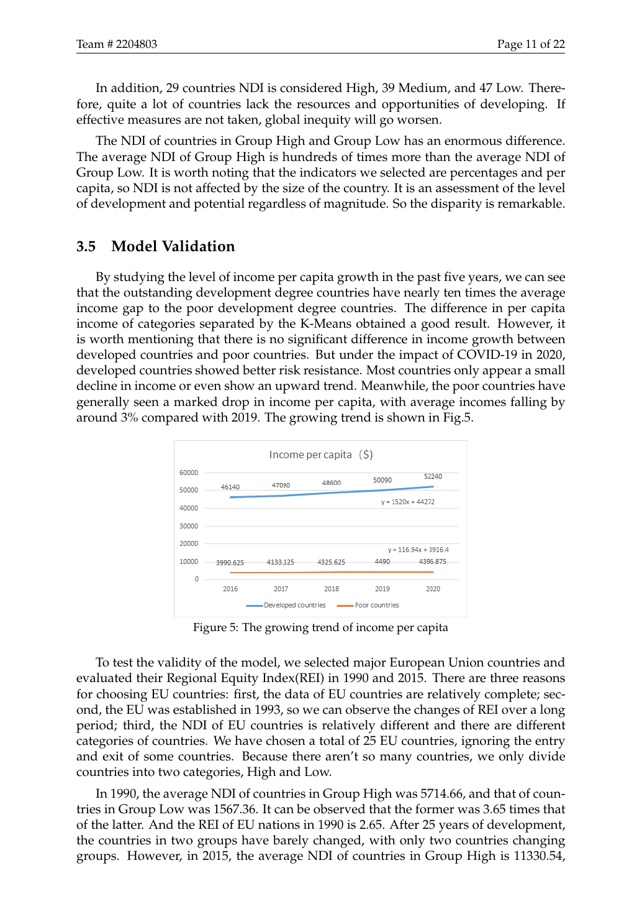

*2022 F 题整页案例：模型验证和现实对照。*

验证图放在整页里看更清楚：它前后都有解释，不只是一个结果截图。优秀论文会说明验证对象、验证方法和验证结果。

你的验证段要写误差、趋势一致性、异常点和模型边界。

> **这一页怎么学：** 先看图放在论文哪个位置，再看图前有没有铺垫，图后有没有解释。真正要模仿的是这个“位置和连接”，不是直接复制图。

> **写作提醒：** 图表不是撑版面的东西。每张图都要能接一句“因此”，否则它还没有变成论文证据。

## 19 敏感性页：整页看最后如何兜住结论

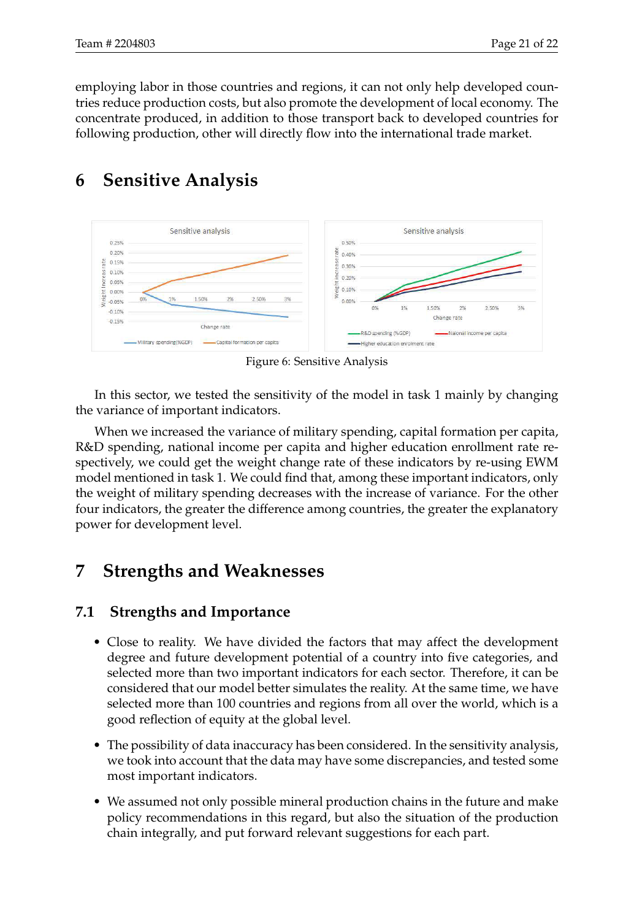

*2022 F 题整页案例：敏感性分析和模型评价。*

敏感性分析放在模型评价部分，目的是说明关键结论是否稳。整页截图能看到它不是孤立图，而是讨论的一部分。

写敏感性时要回答：参数怎么变，结果怎么变，结论变不变。

> **这一页怎么学：** 先看图放在论文哪个位置，再看图前有没有铺垫，图后有没有解释。真正要模仿的是这个“位置和连接”，不是直接复制图。

> **写作提醒：** 图表不是撑版面的东西。每张图都要能接一句“因此”，否则它还没有变成论文证据。

## 20 公式推导页：整页看公式和文字如何穿插

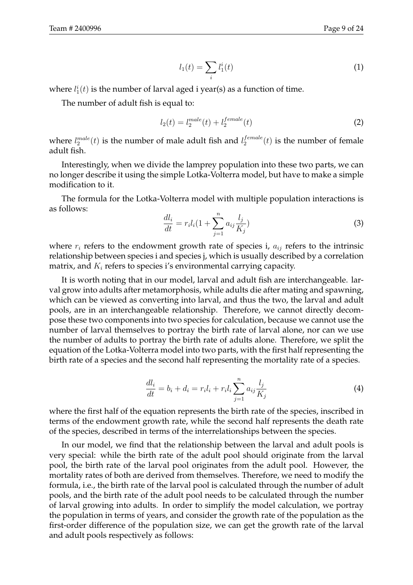

*2024 A 题整页案例：公式链条与自然语言解释。*

公式页最怕全是公式。整页保留后能看到，优秀论文会在公式之间插入文字解释，说明每个方程的含义。

你自己的公式也要有人话翻译：这个式子刻画什么，为什么需要它，变量从哪里来。

> **这一页怎么学：** 先看图放在论文哪个位置，再看图前有没有铺垫，图后有没有解释。真正要模仿的是这个“位置和连接”，不是直接复制图。

> **写作提醒：** 图表不是撑版面的东西。每张图都要能接一句“因此”，否则它还没有变成论文证据。

## 21 假设准备页：整页看假设不是摆设

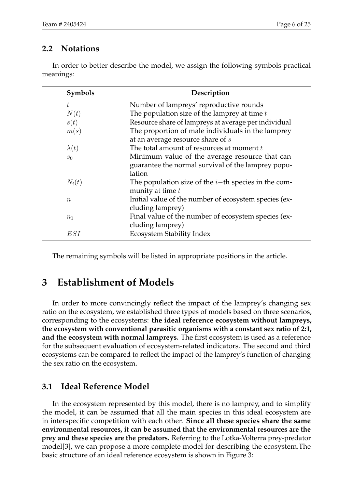

*2024 A 题整页案例：假设、符号和模型准备。*

假设页整页保留很有意义，因为它能看到假设如何连接到后面的模型建立。假设不是免责条款，而是模型边界。

自己的假设要写理由。不要只写“假设所有变量独立”这种强假设却不给解释。

> **这一页怎么学：** 先看图放在论文哪个位置，再看图前有没有铺垫，图后有没有解释。真正要模仿的是这个“位置和连接”，不是直接复制图。

> **写作提醒：** 图表不是撑版面的东西。每张图都要能接一句“因此”，否则它还没有变成论文证据。

## 22 图表分析段的万能结构

### 现象

先说图里看到了什么：趋势、差异、峰值、异常点或聚集区。

> **模板：** 由图X可见……；这一现象主要是因为……；因此，本文在后续模型/策略中……。

### 原因

再解释为什么出现这个现象，要和模型假设、参数或现实机制连接。

> **模板：** 由图X可见……；这一现象主要是因为……；因此，本文在后续模型/策略中……。

### 因此

最后落到题目：影响哪个方案、哪个指标、哪个政策建议。

> **模板：** 由图X可见……；这一现象主要是因为……；因此，本文在后续模型/策略中……。

### 数字

至少给一个关键数，比如阈值、误差、相关系数或占比。

> **模板：** 由图X可见……；这一现象主要是因为……；因此，本文在后续模型/策略中……。

### 边界

如果图里有重叠、异常或波动，要说明模型适用范围。

> **模板：** 由图X可见……；这一现象主要是因为……；因此，本文在后续模型/策略中……。

## 23 常见扣分点

> **图表与结论脱节：** 图很多，但结论不用这些图。给每张图写一句“它证明什么”，写不出就删。

> **坐标轴没单位：** 百分比、指数、标准化值、时间步都要写清楚。

> **图注太空：** 图注要补充参数条件、数据来源、样本范围，不要重复标题。

> **图例混乱：** 正文、图例、附录里的方案名必须统一。

> **只放图不分析：** “如图所示”不是分析，图后至少写现象、原因、因此。

> **公式无解释：** 公式之间要有人话过渡，不要一页全是符号。

> **表格塞作文：** 表格做比较，长解释放正文。

> **附录抢戏：** 核心证据必须在正文，附录只能补充。

## 24 赛场最后两小时救急清单

> **列图表清单：** 所有图表编号列出来，右边写一句它证明什么。

> **补三句分析：** 每张核心图后补：看到什么、为什么、因此怎么办。

> **统一格式：** 变量名、单位、颜色、图例、标题格式全篇统一。

> **改标题：** 把“结果图”改成“某条件下某指标变化”。

> **删重复图：** 两张图说同一件事，只留更清楚的。

> **补边界：** 模型哪里不准、什么参数敏感，要诚实说明。

| 检查项 | 过关标准 |
| --- | --- |
| 必要性 | 每张图能说出一个明确结论 |
| 标题 | 包含对象、变量关系、条件 |
| 坐标轴 | 变量名、单位、范围清楚 |
| 图例 | 颜色、线型、符号都有解释 |
| 图注 | 包含数据来源或参数条件 |
| 正文 | 至少包含现象、原因、因此 |
| 格式 | 同类图表字号、颜色、线宽一致 |

## 25 附录：优秀论文 PDF 与来源

本版图表示例来自公开优秀论文 PDF 的整页截图。现有 PDF 已整理到[优秀论文拆解](../05_优秀论文拆解/README.md)，建议按“摘要、框架图、结果图、验证图、结论”五个位置复盘。

- 2022_Problem_F_2204803.pdf（原手册列出，当前资料库未收录）
- [2023_Problem_C_2300348.pdf](../05_优秀论文拆解/原始论文/2023_Problem_C_2300348.pdf)
- [2024_Problem_A_2400996.pdf](../05_优秀论文拆解/原始论文/2024_Problem_A_2400996.pdf)
- [2024_Problem_A_2405424.pdf](../05_优秀论文拆解/原始论文/2024_Problem_A_2405424.pdf)

来源包括 COMAP MCM/ICM 官方 Results 页面，以及 GitHub 公开仓库 dick20/MCM-ICM 中整理的历年高奖论文。这里只学习写作结构和图表表达方式，正式参赛时不能复制论文文字、图片或模型结论。

## 26 强化讲义：不同题型怎么选图

前面的整页案例主要告诉你优秀论文如何把图表放进正文。下面这一部分更像实战手册：拿到题目后，怎么判断该画什么图、图后该写什么话、哪些图最好不要乱用。比赛时最怕的是“模型做完了，图也有了，但论文像散装零件”。这一章就是把散装零件串成证据链。

### 预测类题目

预测类题目的核心是“未来怎么变”和“预测靠不靠谱”。折线图是主图，误差图是护城河，必要时再加残差图或置信区间图。正文要讲趋势、峰值、低谷、异常波动和预测误差。

> **推荐做法：** 用历史真实值和预测值画同一张折线图，再配一个误差指标表。图后写清楚模型在平稳段、峰值段、突变段的表现。

> **避坑：** 只画一条预测线，不给真实值对比；只说模型准确，但没有 MAPE、RMSE 或相对误差。

### 评价类题目

评价类题目要把抽象目标拆成指标，再把指标合成综合分。常用图包括指标体系图、权重柱状图、雷达图、排序柱状图和地图。正文重点是指标为什么选、权重怎么来、排序说明什么。

> **推荐做法：** 先用逻辑树讲指标体系，再用表格列数据口径，最后用柱状图或地图展示评价结果。

> **避坑：** 指标堆得很多，但没有说明正负向、标准化和权重来源。

### 优化类题目

优化类题目的重点是“约束下怎么选最优”。常用图包括流程图、目标函数收敛曲线、方案对比柱状图、敏感性折线图。正文要写目标、约束、求解方法、最优解解释和约束是否满足。

> **推荐做法：** 把最优方案和备选方案放在同一张表或柱状图里，说明优势来自哪里、代价是什么。

> **避坑：** 只给一个最优数值，不解释约束；或者只说方案最好，不说明为什么可行。

### 机理仿真类题目

机理仿真类题目重在机制解释。流程图、机制图、动态折线图、阶段对比图都很有用。正文不能只说仿真结果，而要说变量之间如何相互影响。

> **推荐做法：** 先画机制图，再给核心方程，最后用折线图展示仿真过程。

> **避坑：** 公式和图表断开，图上变化没有机制解释。

### 空间类题目

空间类题目要回答哪里聚集、哪里风险高、哪里服务不足。地图、热力图、路径图、空间聚类图是主力。正文要写点线面含义、空间聚集和策略落点。

> **推荐做法：** 地图上标出需求点、设施点、风险等级或服务范围，图后转成资源配置建议。

> **避坑：** 地图只当底图，没有空间分析；颜色和点大小没有解释。

## 27 结果表达要写到什么程度

很多同学会问：图后面到底写几句话才够？我的判断是：核心图至少一段，辅助图至少两句，附录图可以不详细展开。核心图就是直接支撑主要结论的图，例如预测曲线、优化结果、评价排序、关键敏感性分析。辅助图是帮助说明背景或过程的图，例如数据分布、变量相关性。

核心图的分析段最好包含五个要素：图中现象、关键数字、机制解释、与任务的关系、下一步动作。比如折线图后写“第100年后曲线下降”只是现象；再补“下降幅度约50%”就是数字；再写“因为环境容量下降”就是机制；再写“说明恢复时间可作为韧性指标”就是任务关系；最后写“因此后续比较两种策略的恢复时间”就是下一步动作。这样一段才算完整。

| 图表地位 | 建议篇幅 | 必须写什么 |
| --- | --- | --- |
| 核心图 | 1段，约120-180字 | 现象、数字、原因、结论、任务回扣 |
| 辅助图 | 2-4句 | 图中主要发现和它为什么有用 |
| 背景图 | 1-2句 | 数据来源、样本范围或直观背景 |
| 附录图 | 可简写 | 正文引用时说明用于补充验证 |

## 28 图表标题的高级写法

图表标题越具体，论文越像成品。低分标题常常是“结果图”“预测图”“热力图”，这种标题没有告诉读者任何信息。高分标题应该包含对象、变量关系和条件。比如“不同资源扰动下种群数量随时间变化”就比“折线图1”强很多，因为读者不用看正文也知道图要说明什么。

> **改标题：** 低分：预测结果图。高分：2022-2023年报告量真实值与预测值对比。原因：说明对象、时间范围和比较关系。

> **改标题：** 低分：敏感性分析。高分：关键参数扰动下综合评价指数变化。原因：说明扰动对象和输出指标。

> **改标题：** 低分：地图。高分：研究区域风险等级空间分布。原因：说明空间对象和变量含义。

> **改标题：** 低分：模型比较。高分：三种策略下系统恢复时间对比。原因：说明比较对象和评价指标。

> **改标题：** 低分：相关性图。高分：词频与游戏得分的回归关系。原因：说明两个变量的关系。

## 29 摘要里怎么写图表结论

摘要里不能放图，但摘要一定要吸收图表结论。也就是说，图表在正文中证明了什么，摘要里要用一句话浓缩出来。比如正文折线图证明动态策略恢复更快，摘要就写“仿真结果表明，动态策略将系统恢复时间缩短约X%”。摘要最怕只列模型名，不列结果。

> **预测题摘要：** 不要只写“建立 ARIMA/LSTM 模型进行预测”，要写“预测结果显示未来三个月需求保持上升，峰值出现在X月，MAPE为Y%”。

> **评价题摘要：** 不要只写“建立综合评价模型”，要写“综合评价结果将样本分为三类，其中A类风险最高，应优先干预”。

> **优化题摘要：** 不要只写“建立优化模型求解最优方案”，要写“最优方案在满足成本约束下使服务覆盖率提高X%”。

> **仿真题摘要：** 不要只写“进行仿真实验”，要写“仿真显示扰动后系统在T时刻恢复稳定，说明策略具有更强韧性”。

## 30 常见错误的改写示范

> **原句：** 由图可知模型效果较好。

> **改后：** 由图可见，预测曲线与真实曲线在整体趋势上保持一致，峰值时段的偏差略大；结合MAPE指标可知，模型能较好刻画总体变化，但对极端波动仍需进一步修正。

> **原句：** 方案A比方案B好。

> **改后：** 方案A在稳定性指标上高于方案B，但计算成本也更高，说明方案A适合高风险场景，方案B更适合低预算或实时性要求较高的场景。

> **原句：** 热力图显示相关性。

> **改后：** 热力图中高相关区域集中在指标X与指标Y附近，说明二者可能存在共同驱动因素；因此后续建模中应避免简单重复赋权，并考虑变量筛选。

> **原句：** 地图展示了分布。

> **改后：** 地图显示样本点沿主干区域聚集，外围区域样本稀疏，说明研究对象具有明显空间不均衡特征，后续参数估计应避免默认均匀分布。

> **原句：** 敏感性分析说明模型稳定。

> **改后：** 当参数在±10%范围内扰动时，核心排序未发生改变，综合指数最大变化幅度较小，说明模型结论对该参数不敏感，具有一定稳健性。

## 31 图表编号和正文引用规范

图表编号看起来是小事，但它直接影响论文专业感。正文里不能出现“如下图”“上面的图”“这个表”这种模糊说法，应该写“如图5所示”“由表3可知”。如果后期增删图表，一定要重新检查编号。

图表出现顺序也要自然。一般是先在正文提到图表，再放图表，再解释图表。不要先突然放一张图，然后过了半页才解释；也不要正文说“见图8”，但图8在前面很远的位置。

> **图前句：** 为了比较两种策略在扰动后的恢复能力，本文绘制种群数量随时间变化曲线，结果如图X所示。

> **图后句：** 由图X可见，动态策略在扰动后的恢复时间更短，且后期波动幅度更小，说明其稳定性优于固定策略。

> **表前句：** 为说明各指标的数据口径和权重来源，本文整理指标体系如表Y所示。

> **表后句：** 由表Y可知，经济类指标权重最高，说明样本间经济差异是综合评价的主要来源。

## 32 论文里哪些图可以删

不是所有图都值得放进正文。图表删减能力很重要，甚至比加图更重要。真正高分的论文不是图最多，而是每张图都有位置。下面这些图通常可以删：正文没有引用的图、只重复表格信息的图、看不清的图、不能支撑结论的图、和题目任务无关的图。

> **正文不引用：** 如果正文从头到尾没提这张图，它大概率不该在正文。

> **重复信息：** 柱状图和表格表达完全一样时，保留更清楚的一个。

> **清晰度低：** 打印后看不清坐标和图例的图，宁可删掉也不要硬放。

> **结论无关：** 能说明数据很好看，但不能说明题目结论的图，放附录或删除。

> **解释成本高：** 如果一张图需要半页解释读者才懂，而它又不是核心图，就换更简单的表达。

## 33 评分视角：评委到底怎么看图表

评委看图表的速度通常很快。他不会像队员一样知道你做了多少工作，所以图表必须降低理解成本。一个评委扫过论文时，最容易被这几类信息抓住：清楚的模型框架、关键结果曲线、方案对比表、误差验证、敏感性分析、结论明确的图注。

换句话说，图表要帮你“省解释成本”。如果一张图让评委停下来想半天，它不一定是高级，可能只是没讲清楚。高分表达不是把图画复杂，而是让复杂问题变得可读。

> **第一眼：** 标题和图形是否能看出研究对象。

> **第二眼：** 坐标、单位、图例是否完整。

> **第三眼：** 图后文字是否把现象解释成结论。

> **最后判断：** 这张图是否支撑题目要求，而不是展示无关工作量。

## 34 最后给队伍的分工建议

真正比赛时，图表表达最好有人专门负责。一个人管模型，一个人管论文结构，一个人管图表和结果解释，这是比较稳的分工。图表负责人不是美工，而是证据链管理员：他要保证每张图都有来源、有编号、有解释、有结论。

> **建模手：** 负责输出可靠数据和图表源文件，别只丢截图。

> **论文手：** 负责把图表嵌入论证顺序，避免图和文字脱节。

> **图表手：** 负责统一标题、图例、单位、颜色和图注。

> **最后统稿：** 从头到尾只看图表编号和正文引用，检查是否跳号、漏号、重复。

## 35 终极检查：一张图过不过关

| 问题 | 如果答案是否定的，就这样改 |
| --- | --- |
| 这张图服务哪条结论？ | 删图或补结论句。 |
| 图题是否具体？ | 改成“对象+变量关系+条件”。 |
| 坐标轴是否有单位？ | 补变量名、单位和无量纲说明。 |
| 图例是否看得懂？ | 用题目语义替换 model1、line2。 |
| 图后是否有分析？ | 补“现象、原因、因此”。 |
| 是否有关键数字？ | 补阈值、误差、比例、相关系数或排序。 |
| 和其他图是否重复？ | 合并或保留更清楚的一张。 |
| 放在正文是否值得？ | 不值得就放附录。 |

到这里，文档的用法就很直接了：先看优秀论文整页截图，学它的图表位置和上下文；再看后面的模板，把自己的变量名和结论填进去；最后用检查清单删掉无效图。论文会立刻从“图很多但散”变成“图表在替结论说话”。
